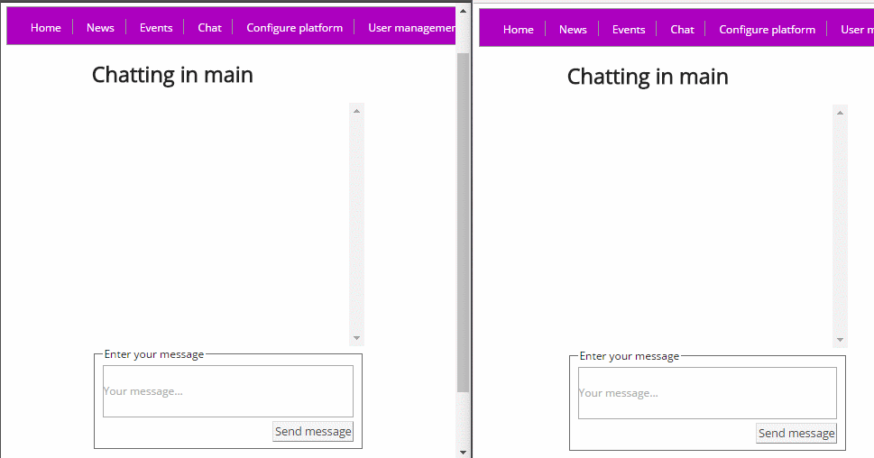

# CLUB - Customized Large User Board

CLUB is a small "template" for use by small communities.

### Main features:
* An admins can configure title, description, color schema etc. 
* An admin can approve or disallow users from being members, as well as promote regular users to admin status.
* All users can see posts representing both news and events, but only admins can create posts. 
* Everyone can comment on a post as well as update and/or delete their own comment.
* Everyone can participate in a group chat, or choose to open a chat for a specific user.

#### Chat preview

## REST API documentation

The REST API is work in progress. The response always has the form of one JSON object containing two properties, `entity` and `links`, where `entity` is the response data (an array or an object) and `links` are an array of links to related resources (and/or to self).

Currently the only some of the standard CRUD operations are available for some of the entities/resources. They are:

### Users
* **Get all** `GET`:`clubproject/api/users`
* **Get by id** `GET`:`clubproject/api/users/{id}`
* **Create user** `POST`:`clubproject/api/users` with JSON payload representing a user
* **Update by id** `PUT`:`clubproject/api/users/{id}`  with JSON payload representing a user (NOTE: be sure to include id both in JSON payload and URL)

### Posts
* **Get all** `GET`:`clubproject/api/posts`
* **Get by id** `GET`:`clubproject/api/posts/{id}`

### Comments (Posts sub-resource)
* **Get all** `GET`:`clubproject/api/posts/{post_id}/comments`
* **Get by id** `GET`:`clubproject/api/posts/{post_id}/comments/{comment_id}`

